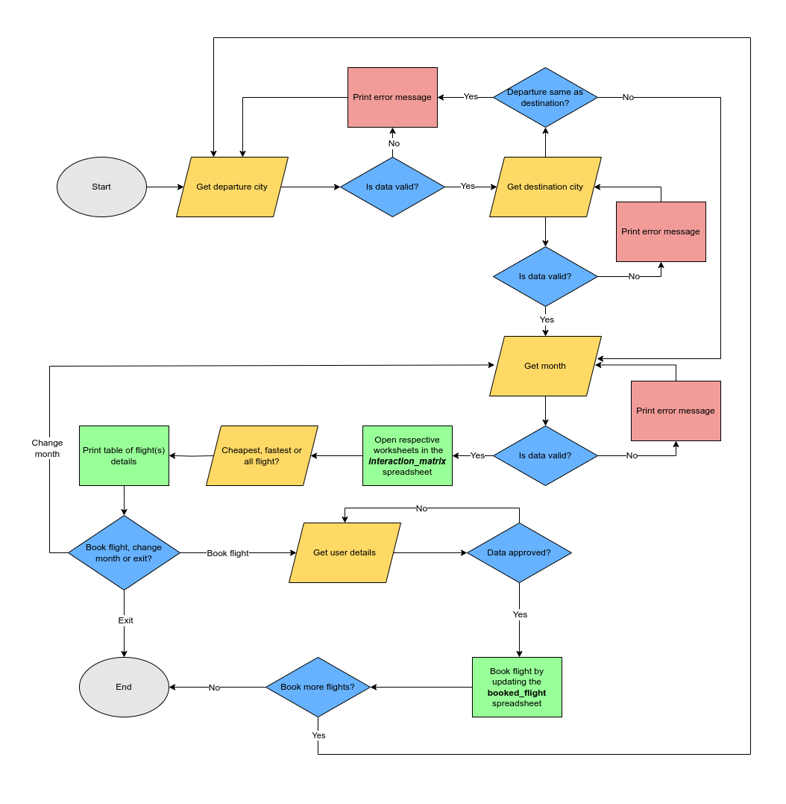
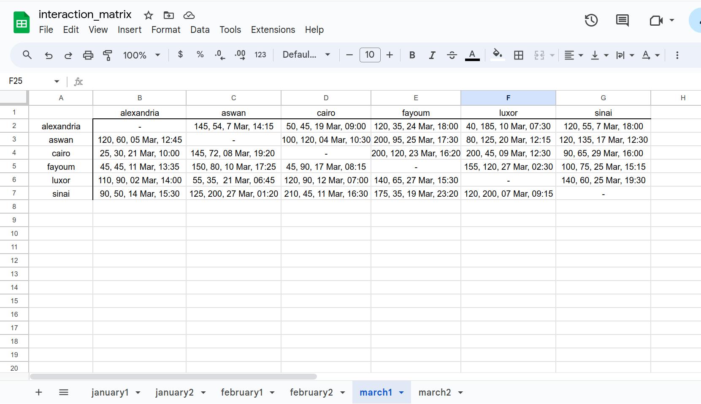
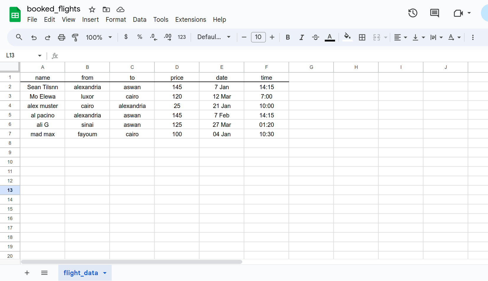

# Flight Scanner

## Contents

* [Introduction](#introduction)
* [User Experience](#user-experience)
* [Owner goals](#owner-goals)
* [Pre development](#pre-development)
* [Development](#development)
* [Features](#features)
* [Google Sheets](#google-sheets)
  * [Interaction Matrix](#interaction_matrix)
  * [Booked Flights](#booked_flights)
* [Technologies Used](#technologies-used)
  * [Languages](#languages)
  * [Frameworks & Libraries](#frameworks--libraries)
* [Testing](#testing)
  * [Validation](#validation)
  * [Test Cases](#test-cases)
  * [Known Bugs](#known-bugs)
* [Deployment](#deployment)
  * [Google API](#google-api)
  * [Heroku](#heroku)
* [Credits](#credits)
  * [Code Used](#code-used)
  * [Acknowledgements](#acknowledgements)

  - - -

## Introduction

The deployed project live link is [HERE](https://flight-scanner-0dcd2cac6601.herokuapp.com/)

<figure align="center">
  
  <figcaption> Map of main sight seeing locations in Egypt. <a href="https://www.worldhistory.org/image/12990/map-of-ancient-egypt/" target="_blank"> Source </figcaption>
</figure>

## User Experience

## Owner Goals

## Pre development

## Development

## Features

## Google Sheets

## Technologies Used

### Languages

* Python3.12.3

### Frameworks & Libraries

* [Git](https://git-scm.com/) for version control
* [Github](https://github.com/) to store code and other files
* [GitPod](https://gitpod.io/) IDE to create and edit the codes
* [Draw IO](https://app.diagrams.net/) to draw flowcharts
* [Heroku](https://www.heroku.com/) for cloud application deployment
* [Google Console](https://console.cloud.google.com/) to create API for google sheets
* [Python - prettytable](https://pypi.org/project/prettytable/) to print the table of flight details in python
* [Python - colorama](https://pypi.org/project/colorama/) to style the displayed terminal font color
* [Python - google-auth](https://pypi.org/project/google-auth/) for using Google’s various server-to-server authentication mechanisms to access Google APIs
* [Python - gspread](https://pypi.org/project/gspread/) interface for working with Google Sheets.

## Deployment

### Heroku

The app is deployed using Heroku platform. To Deploy the app:

1. Create a new app, add a unique app name (e.g. flight-scanner) and then choose the region
2. Click on "Create app"
3. Go to "Settings"
4. Under Config Vars add "CREDS" as a "KEY" and the private API key json content (obtained from [google console](console.cloud.google)) as a "VALUE".
5. In Config Vars, add "PORT" as "KEY" and '8000' as "VALUE".
6. Add required buildpacks. For this project, Python and Nodejs were used in this order.
7. Go to "Deploy" and select "GitHub" in "Deployment method"
8. To connect Heroku app to the Github repository enter the repository name, click 'Search' and then 'Connect'.
9. Choose the branch you want to build your app from, here it was `main`
10. If preferred, click on "Enable Automatic Deploys", which keeps the app up to date with your GitHub repository
11. Wait for the app to build. Once ready you will see the “App was successfully deployed” message and a 'View' button to take you to your deployed link.

## Credits

### Code Used

* Get the value of a cell in prettytable [snippet](https://stackoverflow.com/questions/24365655/how-to-get-the-value-of-a-cell-when-using-prettytable)
* Check if string contains number [snippet](https://stackoverflow.com/questions/19859282/check-if-a-string-contains-a-number)
* Check if string contains special chatacters [snippet](https://stackoverflow.com/questions/57062794/is-there-a-way-to-check-if-a-string-contains-special-characters)

### Acknowledgement

I would like to thank my Code Institute mentor Jubril Akolade for his feedback and support