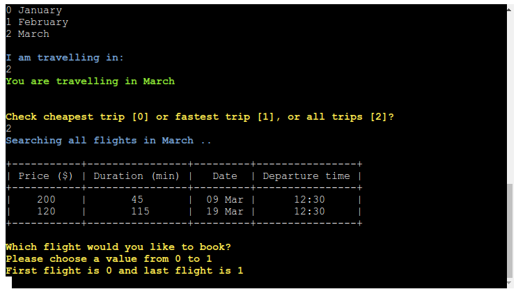
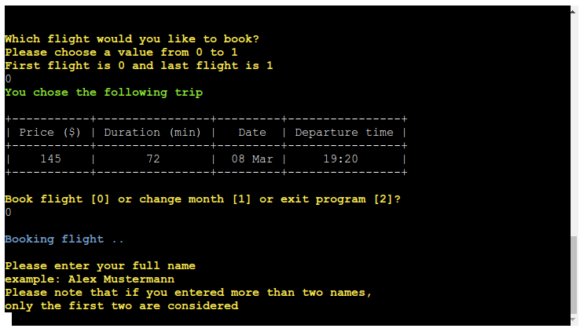

# Flight Scanner

## Contents
* [Introduction](#introduction)
* [User Experience](#user-experience)
* [Owner goals](#owner-goals)
* [Pre-development](#pre-development)
* [Features](#features)
* [Google Sheets](#google-sheets)
  * [Interaction Matrix](#interaction_matrix)
  * [Booked Flights](#booked_flights)
* [Technologies Used](#technologies-used)
  * [Languages](#languages)
  * [Frameworks & Libraries](#frameworks--libraries)
* [Testing](#testing)
  * [Validation](#validation)
  * [Test Cases](#test-cases)
  * [Known Bugs](#known-bugs)
* [Deployment](#deployment)
* [Credits](#credits)
  * [Code Used](#code-used)
  * [Acknowledgements](#acknowledgements)

- - -

## Introduction

The deployed project live link is [HERE](https://flight-scanner-0dcd2cac6601.herokuapp.com/)

The app aims as a quick tool for users to check flights within Egypt's main sight-seeing sites (as shown on the map) in the high season months. The users have the opportunity to interact with a database (Google spreadsheet) to inquire about the cheapest, fastest or display all flights available for the selected month. The process to book a flight is made simple and with multiple checks on data entries along the way. After successfully booking a flight, another database is updated with the user's name and ticket choice.

  

  Map of main sight seeing locations in Egypt. <a href="https://www.worldhistory.org/image/12990/map-of-ancient-egypt/" target="_blank"> Source

## User Experience

The application users aim for the following
* Quick and effortless interface to search for flights
* Ability to filter flight search based on cheapest or fastest flights
* Receive clear feedback on their input

## Owner Goals
The application developers/owners aim for the following
* Organized way of keeping record of user information and choices
* Develop a program where new features can be appended easily
* Present clear instructions and feedback to the users whenever possible

## Pre-development

To help designing the algorithm behind the application, a flowchart was used. The flowchart combines input from user (orange parallelograms) used as input for decision-making (blue rhombi) check points. A decision is then taken to mainly validate the user input and generate the respective error (red rectangles) if the user gave an unexpected input. If the user's input passes i.e. error-free, a database is open for reading or writing and the database entries are displayed  (green rectangles).

## Features

* User input confirmation: the user gets their input displayed back at them to confirm it

* Rejecting input of destination city same as departure

* Accept numeric input as well as incomplete alphabetic input for cities and months

* Tabular display for flight details for a visual display of data

* Reject values outside the range given with the appropriate feedback message

* Appropriate feedback messages and use of colors: Yellow representing waiting for user input, blue for buffer messages to open or fetch data from databases and green for confirming input

* Allow user to correct input 

* Navigation within the program

* Future features may inlcude
  * Adding more details about the airports and displaying this in the message before booking
  * Improved navigation options
  * Add birthdate or email into user input to distinguish users with same name and flight details
  * Allow user to book for more than one person at a time

## Google Sheets

Google spreadsheets were used as the databases to read from (the *interaction_matrix* spreadsheet) or write into (*booked_flights* spreadsheet).

The interaction matrix was built to represent cities from-to flights. The first column represents the departure cities and the first row represents the destination cities. An example would be a flight from Luxor to Sinai is to row 6 column G, thus the respective cell would be G6. The cell contains 4 pieces of information: the price, the duration, the date and the time of the flight. These are to extracted and displayed by the python program.

The *interaction_matrix* sheet has 6 worksheets, 2 for each of the three months. These 2 worksheets represent flight options available in the month. The database can be appended with more months and more flights. 

The *booked_flights* spreadsheet keeps a record of a user's chosen flight in addition to their name. Specifically, the record contains: name, from (city of departure), to (city of destination), price, date and time of flight. Each time a user interacts successfully with the program and chooses to book the flight, an entry is added to this spreadsheet.

## Technologies Used

### Languages

* Python3.12.3

### Frameworks & Libraries

* [Git](https://git-scm.com/) for version control
* [Github](https://github.com/) to store code and other files
* [GitPod](https://gitpod.io/) IDE to create and edit the codes
* [Draw IO](https://app.diagrams.net/) to draw flowcharts
* [Techsini](https://techsini.com/multi-mockup/) to show the website image on a range of devices
* [Heroku](https://www.heroku.com/) for cloud application deployment
* [Google Console](https://console.cloud.google.com/) to create API for google sheets
* [Python - prettytable](https://pypi.org/project/prettytable/) to print the table of flight details in python
* [Python - colorama](https://pypi.org/project/colorama/) to style the displayed terminal font color
* [Python - google-auth](https://pypi.org/project/google-auth/) for using Google’s various server-to-server authentication mechanisms to access Google APIs
* [Python - gspread](https://pypi.org/project/gspread/) interface for working with Google Sheets.

## Testing

The project was manually tested on Gitpod and Heroku terminals. The project was tested for functionality i.e. that it outputs what is intended or expected from it according to the algorithm presented in the flowchart. Also the program was tested by intentionally provding invalid input to properly give the user feedback on their wrong input if given.

### Validation

* PEP8
  * [CI Linter](https://pep8ci.herokuapp.com/#) was used to check the python code, the message *"All clear, no errors found"*

### Test Cases

The following test cases were performed on the program

| Feature | Expected Outcome | Testing Performed | Result | Pass/Fail |
| --- | --- | --- | --- | --- |
| Input confirmation | user gets their input displayed back at them | type input (e.g. departure city) | departure city is displayed | pass |
| Rejecting out of database cities | user types city out of database | type input | 'not in database' message is displayed | pass |
| Visual display of flight details | user receives a table of flight details | enter choice of cheapest/fastest/all trips | table is displayed | pass |
| Display cheapest/fastest flight | user receives a table of cheapest/fastest flight details | enter choice of cheapest/fastest trips | table is displayed | pass |
| Rejecting non-alphabetic/numeric/empty input in name | user gets notified that their input is invalid | type name with numbers or special characters | 'invalid name' message is displayed | pass |
| Navigating to beginning | user gets a message to restart the program | reach the final step of booking successfully and type 'y' | user is redirected to book a new flight | pass |

### Known Bugs

* When the user chooses cheapest or fastest flight, there might exist in the database more than one flight with the same price or duration. The program will automatically display the first flight in the database. Instead shall be displayed **all** flights that categorize as cheapest or fastest and they have to decide

## Deployment

The app is deployed using [Heroku](https://www.heroku.com/) platform. To Deploy the app:

1. Create a new app, add a unique app name (e.g. flight-scanner) and then choose the region
2. Click on "Create app"
3. Go to "Settings"
4. Under Config Vars add "CREDS" as a "KEY" and the private API key json content (obtained from [google console](console.cloud.google)) as a "VALUE".
5. In Config Vars, add "PORT" as "KEY" and '8000' as "VALUE".
6. Add required buildpacks. For this project, Python and Nodejs were used in this order.
7. Go to "Deploy" and select "GitHub" in "Deployment method"
8. To connect Heroku app to the Github repository enter the repository name, click 'Search' and then 'Connect'.
9. Choose the branch you want to build your app from, here it was `main`
10. If preferred, click on "Enable Automatic Deploys", which keeps the app up to date with your GitHub repository
11. Wait for the app to build. Once ready you will see the “App was successfully deployed” message and a 'View' button to take you to your deployed link.

## Credits

### Code Used

* Get the value of a cell in prettytable [snippet](https://stackoverflow.com/questions/24365655/how-to-get-the-value-of-a-cell-when-using-prettytable)
* Check if string contains number [snippet](https://stackoverflow.com/questions/19859282/check-if-a-string-contains-a-number)
* Check if string contains special chatacters [snippet](https://stackoverflow.com/questions/57062794/is-there-a-way-to-check-if-a-string-contains-special-characters)

### Acknowledgement

I would like to thank my Code Institute mentor Jubril Akolade for his feedback and support
